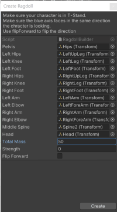
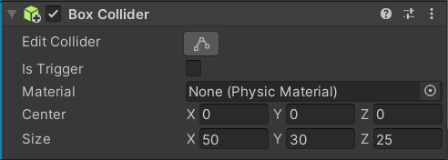
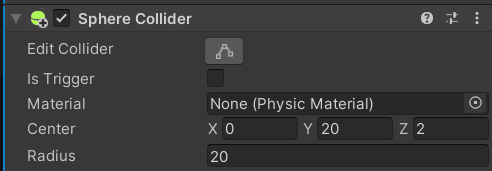
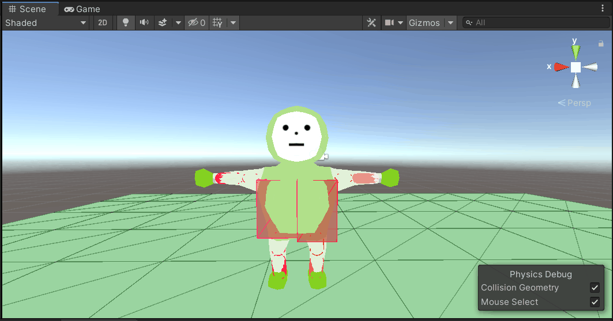
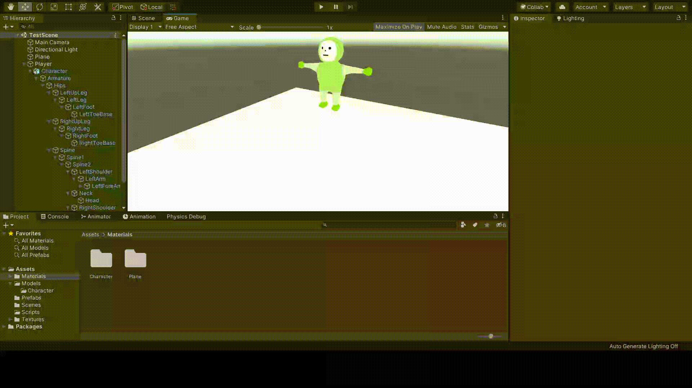
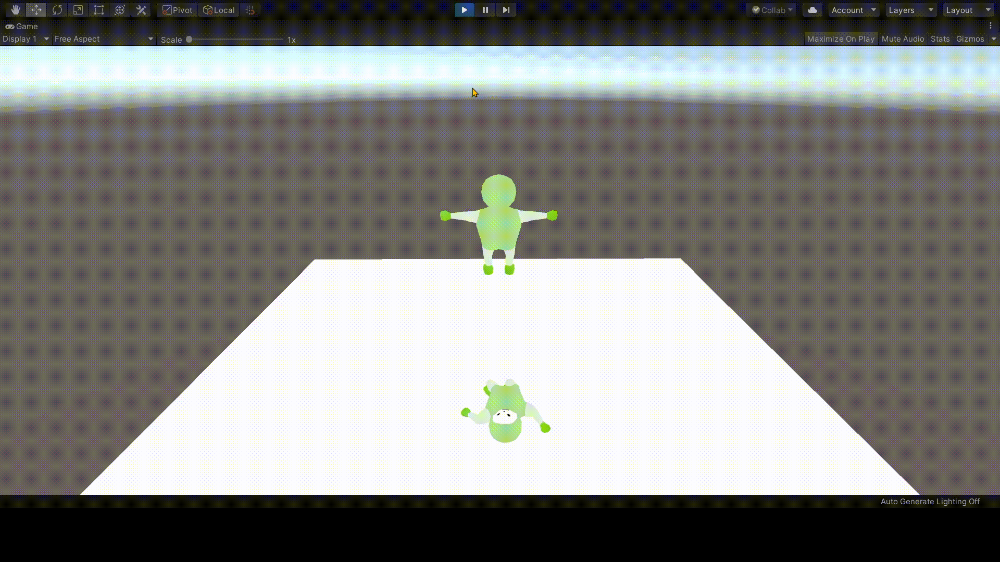

# Active-Ragdoll

## Settings

### **1. Create Ragdoll**

- Creates Ragdoll: `GameObject` - `3D Object` - `Ragdoll...`
  - Unity 자체 Ragdoll로 생성

|              Create ragdoll               |                        Create ragdoll settings                         |
| :---------------------------------------: | :--------------------------------------------------------------------: |
| `GameObject` - `3D Object` - `Ragdoll...` |  |

---

### **2. Collider Settings**

- Set collider size
  - Ragdoll의 collider의 크기를 몸 크기와 맞도록 조절한다.

|                             set hips                              |                              set spine2                               |                             set head                              |
| :---------------------------------------------------------------: | :-------------------------------------------------------------------: | :---------------------------------------------------------------: |
|  |  |  |

|                              before                               |                              after                              |                              result                               |
| :---------------------------------------------------------------: | :-------------------------------------------------------------: | :---------------------------------------------------------------: |
|  |  |  |

---

### **3. Set Character Joint**

- `Axis`: 회전축(Pivot 기준으로 조절, Move Gizmo 이용)
- `Swing Axis`: Joint가 회전하게 될 두 번째 축(= 굽혀지는 축)

---

### **Moving the Character**

- 캐릭터를 움직인다. ex) 겟엠프드 방식
  - Key를 동시에 누를 경우, 대각선으로 갈 수 있도록 한다.
  - 모든 Vector3 값을 더한 후, 정규화를 통해 방향을 알아낸다.
  - `Quaternion.LookRotation(벡터3.normalized);`를 이용.

```C#
private void move()
{
    Vector3 directionVector3 = Vector3.zero;    // 방향 벡터

    if (Input.GetKey(KeyCode.UpArrow))      // ↑
    {
        directionVector3 += Vector3.forward;
    }
    if (Input.GetKey(KeyCode.DownArrow))    // ↓
    {
        directionVector3 += Vector3.back;
    }
    if (Input.GetKey(KeyCode.RightArrow))   // →
    {
        directionVector3 += Vector3.right;
    }
    if (Input.GetKey(KeyCode.LeftArrow))    // ←
    {
        directionVector3 += Vector3.left;
    }

    if (directionVector3.magnitude != 0)
    {
        // 방향을 바라보게 함. (by using. 벡터 정규화)
        transform.rotation = Quaternion.LookRotation(directionVector3.normalized);

        // 캐릭터는 앞으로만 가도록 한다.
        // 방향 벡터의 크기(magnitude)만큼 움직인다.
        transform.Translate(Vector3.forward * playerSpeed * Time.deltaTime);
    }
}
```

|                         Result: ↑, ↓, →, ←, ↗, ↙, ↖, ↘                         |
| :----------------------------------------------------------------------------: |
|  |

---
