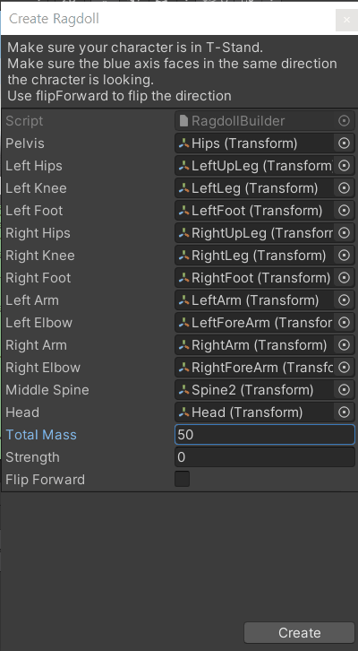
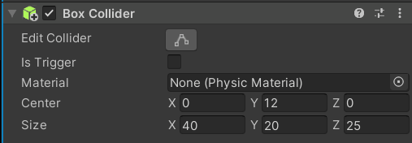
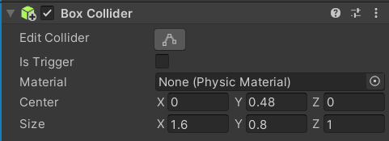
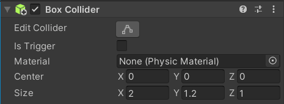
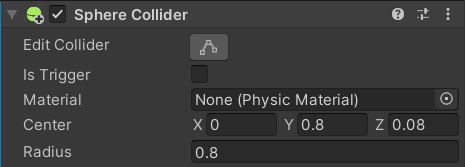
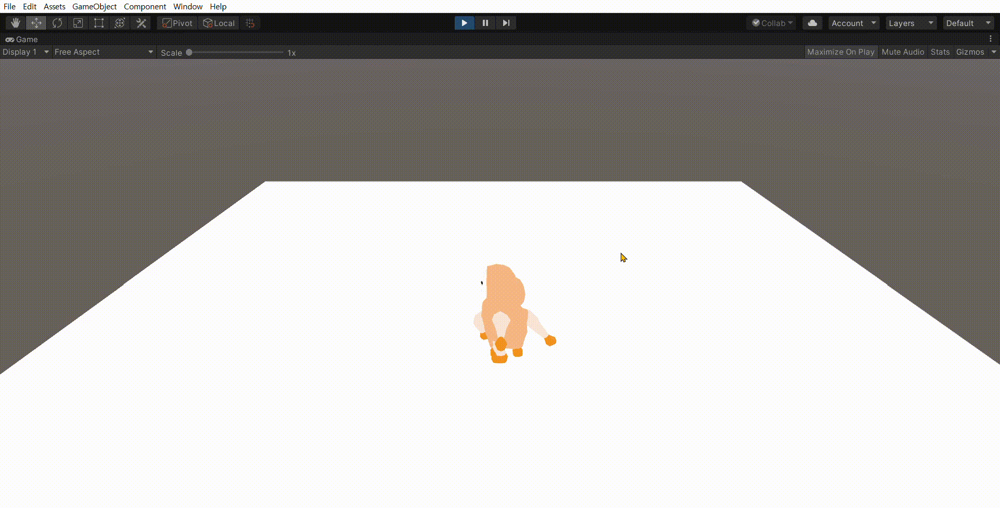
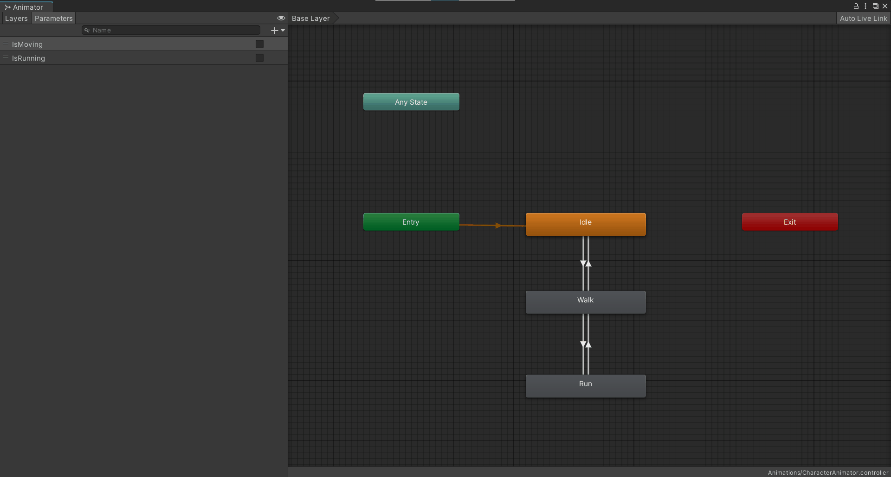
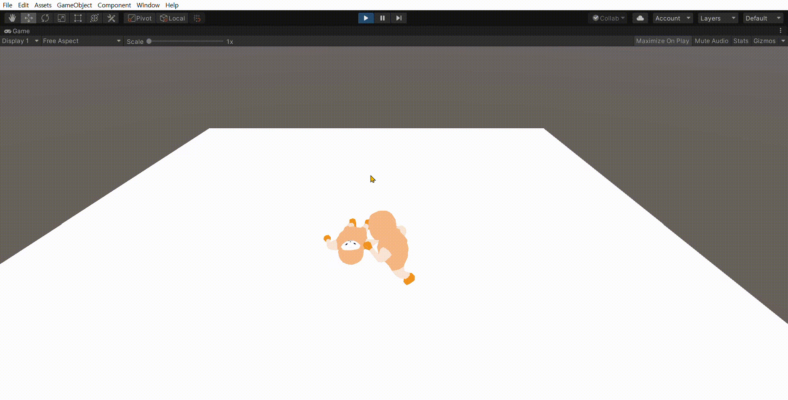

# study_active-ragdoll

## Settings

### **1. Create Ragdoll**

- Creates Ragdoll: `GameObject` - `3D Object` - `Ragdoll...`

  - Unity 자체 Ragdoll로 생성
  - 'Total Mass' : 몸무게?(질량) 설정

|              Create ragdoll               |                 Create ragdoll settings                 |
| :---------------------------------------: | :-----------------------------------------------------: |
| `GameObject` - `3D Object` - `Ragdoll...` |  |

---

### **2. Collider Settings**

- Set collider size  
  : Ragdoll의 collider의 크기를 몸 크기와 맞도록 조절한다.

|                  set `hips`(ex. 1)                  |                   set `spine2`(ex. 2)                   |                  set `head`(ex. 3)                  | set the other body parts(ex. 4, 5, ...) |
| :-------------------------------------------------: | :-----------------------------------------------------: | :-------------------------------------------------: | :-------------------------------------: |
|  |  |  |        Body parts that don't fit        |
|  |  |  |           ex) Legs, Arms, ...           |

|                     before                      |                     after                     |                     result                      |
| :---------------------------------------------: | :-------------------------------------------: | :---------------------------------------------: |
|  |  |  |

---

### **3. Set Character Joint**

- `Axis`: 회전축(Pivot 기준으로 조절, Move Gizmo 이용)
- `Swing Axis`: Joint가 회전하게 될 두 번째 축(= 굽혀지는 축)

---

### **Moving the Character**

- 캐릭터를 움직인다. ex) 겟엠프드 방식
  - Key를 동시에 누를 경우, 대각선으로 갈 수 있도록 한다.
  - 모든 Vector3 값을 더한 후, 정규화를 통해 방향을 알아낸다.
  - `Quaternion.LookRotation(벡터3.normalized);`를 이용.

#### Without Animator

- `playerSpeed`에 따라서 움직이는 거리가 다르다.

```C#
private void move()
{
    Vector3 directionVector3 = Vector3.zero;    // 방향 벡터

    if (Input.GetKey(KeyCode.UpArrow))      // ↑
    {
        directionVector3 += Vector3.forward;
    }
    if (Input.GetKey(KeyCode.DownArrow))    // ↓
    {
        directionVector3 += Vector3.back;
    }
    if (Input.GetKey(KeyCode.RightArrow))   // →
    {
        directionVector3 += Vector3.right;
    }
    if (Input.GetKey(KeyCode.LeftArrow))    // ←
    {
        directionVector3 += Vector3.left;
    }

    if (directionVector3.magnitude != 0)
    {
        // 방향을 바라보게 함. (by using. 벡터 정규화)
        transform.rotation = Quaternion.LookRotation(directionVector3.normalized);

        // 캐릭터는 앞으로만 가도록 한다.
        // 방향 벡터의 크기(magnitude)만큼 움직인다.
        transform.Translate(Vector3.forward * playerSpeed * Time.deltaTime);
    }
}
```

- 결과

|                   `↑`, `↓`, `→`, `←`, `↗`, `↙`, `↖`, `↘`                   |
| :------------------------------------------------------------------------: |
|  |

#### With Animator

- Walk, Run animation은 **In Place Animation**을 사용
- `moveSpeed`에 따라서 움직이는 거리가 다름.  
  Why. **In Place Animation**을 사용했기 때문에

```C#
private void move()
{
    Vector3 directionVector3 = Vector3.zero;    // 방향 벡터
    float moveSpeed = 0.0f;

    if (Input.GetKey(KeyCode.UpArrow))      // ↑
    {
        directionVector3 += Vector3.forward;
        moveSpeed = walkSpeed;
    }
    if (Input.GetKey(KeyCode.DownArrow))    // ↓
    {
        directionVector3 += Vector3.back;
        moveSpeed = walkSpeed;
    }
    if (Input.GetKey(KeyCode.RightArrow))   // →
    {
        directionVector3 += Vector3.right;
        moveSpeed = walkSpeed;
    }
    if (Input.GetKey(KeyCode.LeftArrow))    // ←
    {
        directionVector3 += Vector3.left;
        moveSpeed = walkSpeed;
    }

    if (moveSpeed != 0.0f)      // 움직인다면
    {
        if (directionVector3 != Vector3.zero)
        {
            // 방향을 바라보게 함. (by using. 벡터 정규화)
            transform.rotation = Quaternion.LookRotation(directionVector3.normalized);
        }

        if (Input.GetKey(KeyCode.E))
        {
            // 뛰기
            moveSpeed = runSpeed;
        }
    }

    // Animation 제어
    animator.SetBool("IsMoving", moveSpeed != 0);   // 움직임
    animator.SetBool("IsRunning", moveSpeed == runSpeed);   // 뛰기

    // 캐릭터는 앞으로만 가도록 한다.
    // 방향 벡터의 크기(magnitude)만큼 움직인다.
    transform.Translate(Vector3.forward * moveSpeed * Time.deltaTime);
}
```

- 결과

|                        Animator                        |          `↑`, `↓`, `→`, `←`, `↗`, `↙`, `↖`, `↘` + `E Key`(Run)          |
| :----------------------------------------------------: | :---------------------------------------------------------------------: |
|  |  |

---
